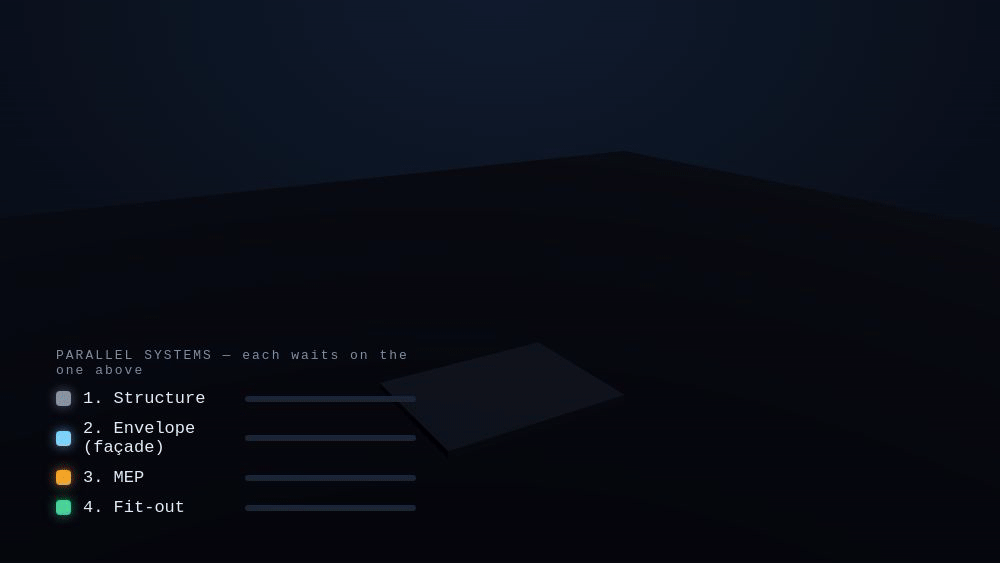

# Open Gates

**See and control your operations — one accepted fact at a time.**
Not task management. Fact acceptance.

Most operational problems don't begin with the absence of a big system. They
begin with a fact that has been **claimed, but not yet accepted**:

- Someone says the work is done.
- Someone says the goods were delivered.
- Someone says the batch passed quality control.
- Someone says the service was rendered.

Until another role accepts that statement, the operation hangs: money can't be
paid with confidence, the next stage can't open safely, responsibility is
unclear, risk hangs in the air. Open Gates turns each of those moments — a
**gate** — into something you can **see on a live map, verify against a trusted
reference, and control**.

Underneath, every gate is an **Acceptance Act**: a typed, event-sourced,
replayable step where a claim becomes a payable fact. That rigor is what makes
the operational picture *trustworthy* rather than just pretty — see
[Under the hood](#under-the-hood-a-verifiable-acceptance-standard).



*A real project as a live operational map — the actual control surface
([`viz/viewer/control/`](viz/viewer/control/)), replaying the facts the engine has
**accepted**. The building rises out of the excavation pit; each block is a
**zone**, its colour how far it's been accepted — structure → envelope → MEP →
fit-out sweeping through in dependency order — while the tower crane climbs with
the build and lifts blocks from a ground queue onto the current top, in lockstep
with the timeline. Click a zone to see the work and documents behind it. This is
the operation, under control. Walkthrough: [`examples/construction/e2e/`](examples/construction/e2e/).*

---

## One gate, up close

Zoom into a single cell of that map. A contractor claims **120 m³** of concrete.
An independent survey — the trusted **reference** — reads **117 m³ ± 4** (k=2).
The gap is measured against the *survey*, not the claim (`|120−117| = 2.56%`,
inside both the 5% tolerance and the measurement uncertainty), a site supervisor
**accepts on the surveyed 117**, and the consequences fall out: money on what was
accepted, the right to start the next work package, owned liability, a labelled
record.


```jsonc
{ "status": "accepted", "checksPassed": true, "cycleDays": 2.25,
  "consequences": [
    { "effect": "money", "payload": { "quantity": 117, "quantitySource": "accepted",
        "gross": 9945, "retention": 497.25, "net": 9447.75, "vat": 1889.55 } },
    { "effect": "right_to_proceed", "payload": { "unlocks": "WP-foundation-closeout" } },
    { "effect": "risk", "payload": { "assignedTo": "technical_supervisor" } } ] }
```

A **disputed** claim (survey 100 vs. claim 120 — 20%, far outside tolerance)
cannot be accepted: only the audit label fires, no money, the stage stays locked.
That moment — a *claim* becoming an *accepted fact with consequences*, paid on
**reality not the assertion** — is the unit the whole operational map is built
from. Control the gates, and you control the operation.

---

## Where are your gates?

Business usually says "we need a CRM / a dashboard / AI / automation." Open Gates
asks the cheaper, sharper question:

> **Where is your most expensive disputed fact?**

```text
construction:   contractor claims a volume — site supervision hasn't accepted it
logistics:      driver claims delivery — customer disputes it
manufacturing:  a batch is claimed good — QC finds a defect
retail:         supplier claims a shipment — the warehouse received less
healthcare:     a service was rendered — the insurer won't confirm it
agriculture:    a field was treated — the agronomist isn't sure
```

Every row is the same thing: **a fact has been asserted, but not yet accepted.**
Find that one gate, model it, put it under control — your entry point into
digitizing an operation without a giant ERP rollout. Case catalog:
[`examples/`](examples/).

---

## Seeing and controlling it

A fact isn't only *how much* and *when* — often it is *where*. A claim can carry
a **zone**: a place in a 3D model of the operation (here, one block of a
building — *section × row × floor*). That turns the map into a two-way control
surface:

- **Report from the map.** A site supervisor selects the zone where work just
  finished and submits a report — that *is* the claim (`claim.submitted`), bound
  to a real place. No abstract form; you point at the building.
- **Control from the map.** Evidence attaches to the same zone, checks run, a
  proven reviewer accepts — and the zone turns "accepted", releasing the money,
  the right to start the next system, and the owned risk. One zone carries
  several **parallel systems** (structure → envelope → MEP → fit-out), each its
  own acceptance, each unlocking the next.

A zone is an **anchor**: `indexByZone` inverts the claim→zone link so clicking a
zone shows every work and document behind it. One canonical model
(`viz/model/building.json`) drives an interactive three.js **zone selector**, an
**OBJ export**, and the animation at the top — so the picture you click and the
facts the engine accepts are the same truth. Worked example:
[`examples/construction/systems/`](examples/construction/systems)
(`npm run demo:zone`); full detail in [`viz/README.md`](viz/README.md).

```bash
python3 -m http.server 8099      # from the repo root, then open /viz/viewer/
```

**The whole cycle, end-to-end.** A full real project — design → excavation pit →
foundation raft → frame → façade → MEP → fit-out → handover → **payments** — driven
through the unchanged engine (~1 560 acceptance acts, real KS-2/KS-3, AOSR, survey,
ZOS) and shown in one shared **control surface**: the 3D object over a timeline
scrubber, a role lens, a KS-3/EVM money dashboard, and a click-a-zone act panel.
Walkthrough: [`examples/construction/e2e/`](examples/construction/e2e/) · open
`/viz/viewer/control/` after `node examples/construction/e2e/drive.ts` · feasibility
verdict: [`docs/e2e-feasibility.md`](docs/e2e-feasibility.md).

**Where this is heading — AR/LiDAR.** The natural next step is the foreman
capturing the *as-built* 3D on site with LiDAR, so "claim vs. reality" becomes
literal geometry. The foundational design that keeps the engine pure while making
that possible (evidence-by-reference, a checkable `ZoneBinding`, a phased plan) is
in [`docs/architecture/spatial-evidence-and-ar.md`](docs/architecture/spatial-evidence-and-ar.md).

---

## Under the hood: a verifiable acceptance standard

The operational map is only as trustworthy as the acceptances under it — so those
are held to a standard. Every gate is an **Acceptance Act**: eight typed elements
`⟨ Context, Subject, Grounds, Criteria, Authority, Decision, Effect, Record ⟩`,
mapped once to the engine's terms in [`GLOSSARY.md`](GLOSSARY.md).

- **Executable & event-sourced.** A case is an append-only log;
  `fold(gate, events) → state` is a **pure, deterministic** reduction — no wall
  clock, no randomness, dedups by event `id`, rejects out-of-order events. Same
  log, same state, forever. Normative in [`SPEC.md`](SPEC.md).
- **Claim vs. reality, done right.** `cross_check` measures error against the
  **reference** (the surveyed value, VIM §2.16), with an absolute floor and — when
  the evidence carries expanded uncertainty `U` (GUM, `U = k·u`) — a hard
  uncertainty band. Honest metrology, not a hand-wave.
- **Money is real.** Paid on the **accepted** quantity, in integer minor units,
  less retention, with a VAT memo; the state carries `cycleDays` for free.
  [`docs/ECONOMICS.md`](docs/ECONOMICS.md).
- **Conformance — the contract is data, not code.** [`conformance/`](conformance/)
  holds the normative state every engine must fold to, in any language.

  ```bash
  npm run conformance   # ✓ construction.accept / dispute / remarks · logistics.accept / dispute
  ```

- **Standards it speaks.** W3C PROV-O, OMG DMN, GUM/VIM, ISO/IEC 17025, ANSI/EIA-748
  (EVM), with an honest load-bearing-vs-decorative split. [`STANDARDS.md`](STANDARDS.md).

## Reference implementation (non-normative)

[`packages/engine/`](packages/engine/) makes the spec executable and generates the
conformance goldens — dependency-free TypeScript, Node ≥ 22.18, no build. Read it
as living pseudocode or run it:

```bash
cd packages/engine
npm test                # determinism · idempotency · fencing · SLA · OAuth · MCP · zones
npm run demo:accept     # fold the accepted case -> €9,447.75 net certified
```

It also ships a **runtime layer that is not part of the standard** — a push/pull
review queue (fencing leases, SLAs, delegation trail), OAuth 2.1 authority where
the reviewer role is *proven* by token scope, an MCP server so an agent can drive
the loop, and guidance for embedding the fold in Temporal / Inngest / Restate.
Conveniences built **on** the Acceptance Act, not part of it:
[review queue](docs/REVIEW-QUEUE.md) · [agents (MCP + OAuth)](docs/MCP.md) ·
[durable execution](docs/DURABLE-EXECUTION.md).

---

## What's in this repository

**Operations — what you see and control:**

| | What | Where |
|---|------|-------|
| **Map** | spatial zones — 3D model, zone selector, OBJ, animation | [`viz/`](viz/README.md) |
| **E2E** | a whole construction project (design → excavation pit → … → payments) folded through the engine on one shared control surface | [`examples/construction/e2e/`](examples/construction/e2e/) |
| **Cases** | the most expensive disputed fact, by industry | [`examples/`](examples/) |
| **AR design** | field-captured (LiDAR) evidence, foundational architecture | [`docs/architecture/`](docs/architecture/spatial-evidence-and-ar.md) |
| **Flow design** | resources (materials, people, rented machines) → capital works, across domains | [`docs/architecture/`](docs/architecture/resource-flow-and-domains.md) |
| **Simulation** | close-to-reality, replayable, resource-constrained runs folded through the unchanged engine | [`docs/architecture/`](docs/architecture/realistic-simulation.md) |

**The standard — what makes it trustworthy (normative):**

| | What | Where |
|---|------|-------|
| **Spec** | the Acceptance Act, events & fold, metrology-aware checks, accepted-quantity money | [`SPEC.md`](SPEC.md) |
| **Schemas** | machine-readable gate / event / scenario / dataset-label | [`spec/schema/`](spec/schema/) |
| **Conformance** | golden states every engine must reproduce | [`conformance/`](conformance/) |
| **Standards** | real, field-level mappings | [`STANDARDS.md`](STANDARDS.md) |

**Implementation & tooling (non-normative):** a reference engine
[`packages/engine/`](packages/engine/), a runtime ([`docs/`](docs/)), and a
[`ROADMAP.md`](ROADMAP.md) of unbuilt verticals.

## The role of assistants

Assistants such as Claude or Codex fit this model well — and not just as chat.
Connected to the engine (there's an [MCP server](docs/MCP.md)), an assistant can
find the disputed case, collect the relevant data, compare a claim against its
evidence, surface the mismatch, and prepare the decision for a human reviewer.
But responsibility stays with the person: the assistant does not make the
business decision — it gets people to the point where they can make it
consciously and faster.

## What it is / is not

**Is:** a way to **see and control real operations**, on top of an open,
verifiable standard for the acceptance boundary — the typed, event-sourced step
where a claim becomes a payable fact, with a conformance suite and one reference
implementation.

**Is not:** a workflow runtime, an ERP, a BPM tool, or an AI framework. The
standard owns the one decision; the map and any product are built on it, not baked
in.

## License

MIT — see [`LICENSE`](LICENSE).
