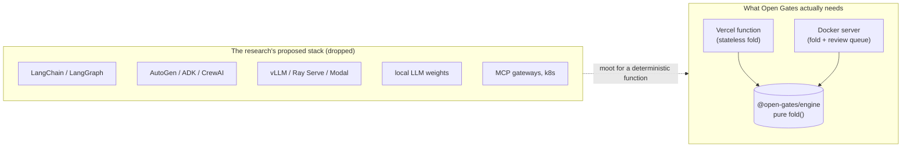

# Review queue & deployment

> Level 5–6 of the [ladder](../README.md#whats-in-this-repository). How to run
> Open Gates as a service, and how reviewers — Claude, another harness, or a
> human — clear cases through a **push & pull** queue.

## Premise: a pure function needs almost no infrastructure

The Open Gates engine is a **pure, deterministic function**: `fold(gate, events)
→ state`. No model sits in its hot path; no GPU, no vector store, no inference
server. The only place an LLM ever appears is *optionally*, as a reviewer that
reads a case and records a decision — and even that is pluggable.

So the deployment story is deliberately small. There are exactly two paths:

| | **Vercel** — the default | **Docker** — for advanced / self-host |
|---|---|---|
| What it runs | the **stateless** engine: `/fold`, `/autodecide` | the engine **plus the review queue** |
| State | none | a file-backed queue on a mounted volume |
| Deploy | push to GitHub → import, or `vercel` | `docker compose up --build` |
| Use it when | you want a zero-config API to fold cases on demand | you need a durable queue, data residency, air-gap, or on-prem |

Pick Vercel if you just want to *compute* acceptance. Pick Docker the moment you
want to *accumulate* cases and have reviewers work through them.



---

## The review queue

A small primitive on top of the engine. A producer **pushes** a case; a reviewer
**pulls** the next one, judges it, and records a decision. The engine folds that
decision in — firing money, the right to proceed, assigned risk, and a dataset
label.

```text
push                         pull                         decide
producer ──▶ POST /queue ─▶ [ pending ] ─▶ POST /queue/lease ─▶ [ leased ] ─▶ POST /queue/:id/decision ─▶ [ decided ]
                                  ▲                                   │
                                  └──────── lease expiry / release ───┘
```

- **Push (enqueue).** `POST /queue { gate, events }`. The server folds the case
  and runs the checks. If the gate's automation policy permits (checks pass and
  value under the ceiling), it **auto-decides** on the spot; otherwise it waits.
  If `OPEN_GATES_WEBHOOK` (or a per-item `notify` URL) is set, a notification is
  pushed so a harness can wake up.
- **Pull (lease).** `POST /queue/lease { role?, domain?, holder? }` hands out the
  oldest matching pending case with a **lease token** and a visibility timeout
  (`LEASE_SECONDS`, default 300). If a reviewer dies, the lease expires and the
  case returns to the pool. `204` means nothing is waiting.
- **Decide.** `POST /queue/:id/decision { outcome, reviewerRole, actor, leaseToken, note }`.
  The engine enforces the invariants: only the gate's `reviewer.role` may decide,
  and a positive outcome needs all blocking checks to pass (otherwise `422`).
- **Release.** `POST /queue/:id/release` hands a leased case back undecided.

Full endpoint list: `GET /` on a running server.

### Reviewers are pluggable

The queue does not care who reviews. Two reference harnesses ship in
[`examples/reviewer/`](../examples/reviewer/):

- a **Claude skill** — [`.claude/skills/review-gate`](../.claude/skills/review-gate/SKILL.md);
- a **dependency-free polling script** — [`poll.mjs`](../examples/reviewer/poll.mjs)
  (swap one function for your own logic, or another harness entirely).

---

## Inboxes & delegation

A flat queue is fine for one reviewer. To distribute work across teams or
people, cases are routed to **inboxes** (named buckets) and/or to specific
**participants** — and **every delegation leaves a trace**.

### Routing

- **Create an inbox**, optionally with a rule that auto-routes matching cases:

  ```bash
  curl -s -X POST "$URL/inboxes" -H 'content-type: application/json' \
    -d '{"name":"supervisors","description":"Site technical supervision",
         "match":{"reviewerRole":"technical_supervisor"}}'
  ```

  On enqueue, a case is routed to the first inbox whose `match` fits (by
  `domain`, `gateId`, or `reviewerRole`), unless you set `inbox`/`assignee`
  explicitly in the enqueue body.

- **Delegate / reassign** an existing case:

  ```bash
  curl -s -X POST "$URL/queue/<id>/assign" -H 'content-type: application/json' \
    -d '{"inbox":"supervisors","assignee":"ivanov","by":"dispatcher:lena",
         "reason":"owns the foundation package"}'
  ```

- **Pull from an inbox** (a participant works their own queue):

  ```bash
  curl -s -X POST "$URL/queue/lease" -H 'content-type: application/json' \
    -d '{"inbox":"supervisors","assignee":"ivanov","holder":"ivanov"}'
  ```

- **See inbox load:** `GET /inboxes` returns each inbox with
  `{ pending, leased, decided, total }` counts plus an `unassigned` total.

### The trace (a hard guarantee)

Every routing, reassignment, claim (lease), release, and escalation appends one
**immutable** entry to the case's `assignments` trail:

```jsonc
"assignments": [
  { "at": "…", "by": "system:router",   "kind": "route",    "inbox": "supervisors" },
  { "at": "…", "by": "dispatcher:lena", "kind": "reassign", "inbox": "supervisors",
    "assignee": "ivanov", "fromInbox": "supervisors", "reason": "owns the foundation package" },
  { "at": "…", "by": "ivanov",          "kind": "claim",    "assignee": "ivanov" }
]
```

Rules the queue enforces:

- **A delegation must name its author.** `assign` without `by` is rejected
  (`400`) — there is no anonymous hand-off.
- **The trail is append-only.** The current `inbox`/`assignee` are *derived* from
  the latest entry; earlier entries are never edited or deleted, and the trail
  travels with the case (it is still there after the case is decided).

> Design note: inboxes and delegation live in the **queue layer**, not in the
> gate engine — routing is a workflow concern, and Open Gates keeps the gate a
> pure truth primitive ("not a workflow engine"). The trail gets the same
> append-only discipline the engine's event log has. If you would rather make
> delegation a *spec-level* event folded into the case log, that is a deliberate
> swap, not the default.

---

## Vercel (default)

Vercel runs the TypeScript in [`api/`](../api/index.ts) directly on its Node.js
runtime (Node 22+) — no build configuration. [`vercel.json`](../vercel.json)
rewrites every path to that one function.

```bash
# option A: git
#   push this repo to GitHub, then "Import Project" on vercel.com

# option B: CLI
npx vercel        # preview
npx vercel --prod # production
```

Then fold a case on demand:

```bash
curl -s -X POST "$URL/fold" -H 'content-type: application/json' \
  --data-binary "{\"gate\": $(cat examples/construction/gate.json),
                  \"scenario\": $(cat examples/construction/scenario.accept.json)}"
# -> { "status": "accepted", "consequences": [ { "effect": "money", "amount": 10200, ... } ], ... }
```

`/queue/*` routes answer `501` on Vercel — the queue is stateful and lives in the
Docker path below. (If you ever want the queue on serverless, implement the
`Store` interface in [`engine/src/queue/store.ts`](../engine/src/queue/store.ts)
against a KV/Redis; nothing else changes.)

---

## Docker (advanced / self-host)

The same engine plus the durable review queue, in one container. The queue is a
single JSON file written atomically to a mounted volume.

```bash
docker compose up --build       # serves on :3000, queue persists in volume "queue-data"
```

Or without compose:

```bash
docker build -t open-gates .
docker run -p 3000:3000 -v og-data:/data open-gates
```

Locally, with nothing but Node ≥ 22.18 (no build, no `npm install`):

```bash
npm run serve                   # node server.ts
```

Walk a case through push → pull → decide:

```bash
URL=http://localhost:3000

# push a case awaiting review (claim + evidence, no decision yet)
curl -s -X POST "$URL/queue" -H 'content-type: application/json' \
  --data-binary "{\"gate\": $(cat examples/construction/gate.json),
                  \"events\": $(node -e 's=require("./examples/construction/scenario.accept.json");process.stdout.write(JSON.stringify(s.events.slice(0,-1)))')}"

# pull the next case for the supervisor role
curl -s -X POST "$URL/queue/lease" -H 'content-type: application/json' \
  -d '{"holder":"claude","role":"technical_supervisor"}'

# decide it (echo the lease token from the previous response)
curl -s -X POST "$URL/queue/<id>/decision" -H 'content-type: application/json' \
  -d '{"outcome":"accepted","reviewerRole":"technical_supervisor","actor":"claude","leaseToken":"<token>","note":"within tolerance"}'
```

Or let the polling harness drain the queue:

```bash
OPEN_GATES_URL=http://localhost:3000 node examples/reviewer/poll.mjs
```

### Operations

- **Persistence.** The queue is `QUEUE_FILE` (default `/data/queue.json` in the
  container). Back up that one file; mount it on durable storage.
- **Data residency.** Everything stays in your container and volume. Nothing
  leaves the network unless you set `OPEN_GATES_WEBHOOK` or a reviewer reaches
  out. The case payload only ever contains what you put in the claim/evidence.
- **Shutdown.** The server drains on `SIGTERM`/`SIGINT`, so in-flight writes
  finish before the container stops.
- **Scope.** A single container is a single writer (the file store assumes one
  process). For multiple writers, put the queue behind a shared `Store`
  (KV/Redis) — the rest of the code is unchanged.

---

## What we deliberately did *not* use

The original research proposed a large self-hosted agent stack. For a pure
deterministic function, almost all of it is unnecessary. The record:

| From the research | Verdict | Why |
|---|---|---|
| LangChain / LangGraph / CrewAI / Deep Agents | drop | Orchestration frameworks for LLM agents; the engine is not an agent and has no chain to run. |
| Microsoft Agent Framework / AutoGen | drop | Multi-agent runtime; the review loop is one HTTP call, not an agent mesh. |
| OpenAI Agents SDK / Google ADK / LlamaIndex / Mastra | drop | Agent/RAG toolkits; nothing here retrieves or reasons over documents. |
| vLLM / Ray Serve / Modal / Ollama | drop | LLM/GPU serving; `fold()` runs in microseconds on a CPU. |
| Local LLM weights (Mistral / Qwen / Llama) | drop | No model is in the hot path. An LLM is only an *optional* reviewer, reached over HTTP. |
| MCP gateways (TrueFoundry / Kong / Lasso), Kubernetes | drop | Enterprise plumbing for an LLM platform we don't run. |
| Flask / FastAPI wrappers | replace | Replaced by a dependency-free `node:http` server reusing the engine. |
| "Self-hosted, data stays in your network" | **Docker** | Satisfied by the container + volume, proportionate to a stateless service. |
| One-command hosted deploy | **Vercel** | The stateless engine, deployed with zero config. |
| Claude skills / plugin packaging | keep (light) | The reviewer is a small `/review-gate` skill — see [`.claude/skills/review-gate`](../.claude/skills/review-gate/SKILL.md). No framework needed. |

The throughline: Open Gates is a primitive, not a platform. The queue adds the
one missing capability — somewhere for cases to wait and reviewers to pull from —
and nothing more.
